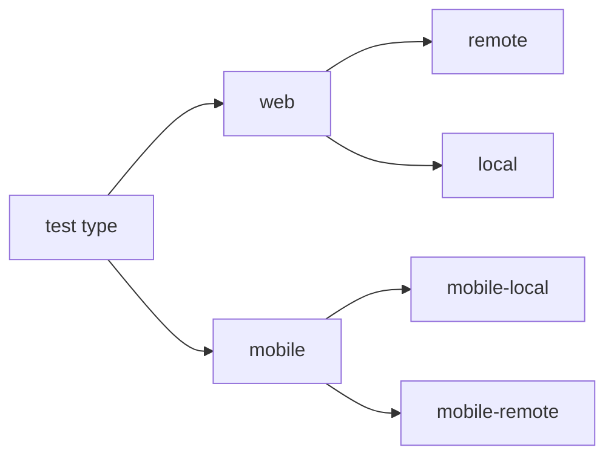

# Test automation project for [webinar.ru](https://webinar.ru/)
</div>

##  <a name="contents">:page_facing_up: Сontents</a>
- [Description](#paperclip-description)
- [Tools and technologies](#hammer_and_wrench-tools-and-technologies)
- [Test cases](#white_check_mark-test-cases)
- [How to run](#arrow_forward-how-to-run)
- [Test results report in Allure Report](#-test-results-report-in-allure-report)
- [Allure TestOps integration](#-allure-testops-integration)
- [Jira integration](#-jira-integration)
- [Telegram notifications](#-telegram-notifications)
- [Sample test run in Selenoid](#-sample-test-run-in-selenoid)

## :paperclip: Description
The project implements web and mobile (android) tests for website and app. \
It has the following features:
- [x] **Page Object** design pattern
- [x] Using **Java Faker** for generating test data
- [x] Parametrized tests
- [x] Different configs using **Owner** for test running 
- [x] Parametrized build
- [x] **Allure TestOps** and **Jira** integration
- [x] Lambda style **Steps**
- [x] Autotests as test documentation

## :hammer_and_wrench: Tools and technologies
<p  align="center"><a href="https://www.jetbrains.com/idea/"></a>
<a href="https://www.java.com"></a>
<a href="https://selenide.org"></a>
<a href="https://junit.org/junit5"></a>
<a href="https://gradle.org"></a>
<a href="https://www.jenkins.io"></a>
<a href="https://qameta.io/allure-report"></a>
<a href="https://qameta.io"></a>
<a href="https://web.telegram.org/"></a> 
<a href="https://www.atlassian.com/software/jira"></a> 
<a href="https://aerokube.com/selenoid/latest/"></a>
<a href="https://www.browserstack.com/automate"></a></p>

## :white_check_mark: Test cases
**UI tests:**
- [x] Successful opening of `Blog` page
- [x] Click `Try` button opens `Sign Up` page
- [x] `Blog page` menu items are enabled, visible and clickable *(parametrized)*
- [x] Click on logo reopens main page
- [x] Click on participant button opens registration sidebar
- [x] Check promo title of main page
- [x] Successful opening of `Tariffs` page
- [x] Webinar tariff type contains expected tariff options *(parametrized)*

**Mobile app tests:**
- [x] Check `Forgot` password button functionality
- [x] Successful user login
- [x] Successful user logout
- [x] Successful user data update

[back to Contents ⬆](#contents)

## :arrow_forward: How to run
### Gradle build
To run tests locally and in `Jenkins` the following gradle command is used:
```bash
$ gradle clean test -Dtag=<tag> -Denv=<env>
```
`tag` - tests with this tag will be executed:
- web
- mobile
 
`env`, `envMobile`  - defines an environment for running these tests:
- local
- remote
- mobile_local
- mobile_remote

Additional parameters:
- `-Dbrowser=` `DbrowserVersion=` `DbrowserSize=` - set parameters for the browser
- `-DremoteUrl=` - set url for remote webdriver

Valid combinations:

### Running tests in Jenkins
Main page of the build:


The build of the project is parameterized, so before starting it, you need to choose parameters.


To run web tests only:


To run mobile tests only:


After the build is done the test results are available in `Allure Report` and `Allure TestOps` 

[back to Contents ⬆](#contents)

##  Test results report in Allure Report

[back to Contents ⬆](#contents)

##  Allure TestOps integration
[back to Contents ⬆](#contents)

##  Jira integration
[back to Contents ⬆](#contents)

##  Telegram notifications
[back to Contents ⬆](#contents)

##  Sample test run in Selenoid
[back to Contents ⬆](#contents)
