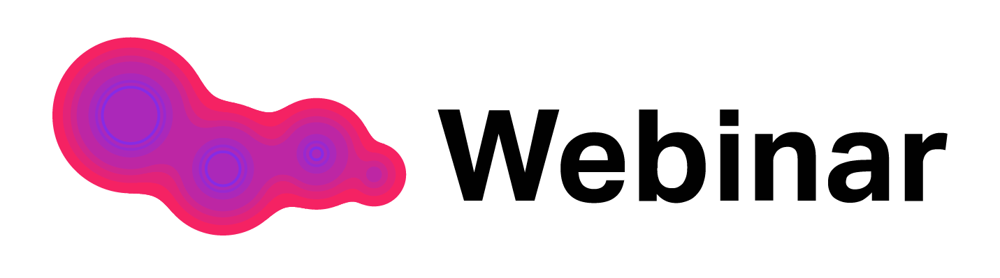

# Test automation project for [webinar.ru](https://webinar.ru/)

## :page_facing_up: Сontents
- [Description](#description)
- [Tools and technologies](#hammer_and_wrench-tools-and-technologies)
- [Test cases](#white_check_mark-test-cases)
- [How to run](#arrow_forward-how-to-run)
- [Test results report in Allure Report](#-test-results-report-in-allure-report)
- [Allure TestOps integration](#-allure-testops-integration)
- [Jira integration](#-jira-integration)
- [Telegram notifications](#-telegram-notifications)
- [Sample test run in Selenoid](#-sample-test-run-in-selenoid)

## Description

## :hammer_and_wrench: Tools and technologies

## :white_check_mark: Test cases

## :arrow_forward: How to run

##  Test results report in Allure Report

##  Allure TestOps integration

##  Jira integration

##  Telegram notifications

##  Sample test run in Selenoid
