# Test automation project for [webinar.ru](https://webinar.ru/)
</div>

##  <a name="contents">:page_facing_up: Сontents</a>
- [Description](#paperclip-description)
- [Tools and technologies](#hammer_and_wrench-tools-and-technologies)
- [Test cases](#white_check_mark-test-cases)
- [How to run](#arrow_forward-how-to-run)
- [Test results report in Allure Report](#-test-results-report-in-allure-report)
- [Allure TestOps integration](#-allure-testops-integration)
- [Jira integration](#-jira-integration)
- [BrowserStack App Automate](#-browserstack-app-automate)
- [Telegram notifications](#-telegram-notifications)
- [Sample test run in Selenoid and BrowserStack](#-sample-test-run-in-selenoid-and-browserstack)

## :paperclip: Description
The project implements web and mobile (android) tests for website and mobile app. \
It has the following features:

- [x] Parametrized build
- [x] Parametrized tests
- [x] **Allure TestOps** and **Jira** integration
- [x] Autotests as test documentation
- [x] **Page Object** design pattern
- [x] Using **Java Faker** for generating test data
- [x] Different configs using **Owner library** for test running

## :hammer_and_wrench: Tools and technologies
<p  align="center"><a href="https://www.jetbrains.com/idea/"></a>
<a href="https://www.java.com"></a>
<a href="https://selenide.org"></a>
<a href="https://junit.org/junit5"></a>
<a href="https://gradle.org"></a>
<a href="https://www.jenkins.io"></a>
<a href="https://qameta.io/allure-report"></a>
<a href="https://qameta.io"></a>
<a href="https://web.telegram.org/"></a> 
<a href="https://www.atlassian.com/software/jira"></a> 
<a href="https://aerokube.com/selenoid/latest/">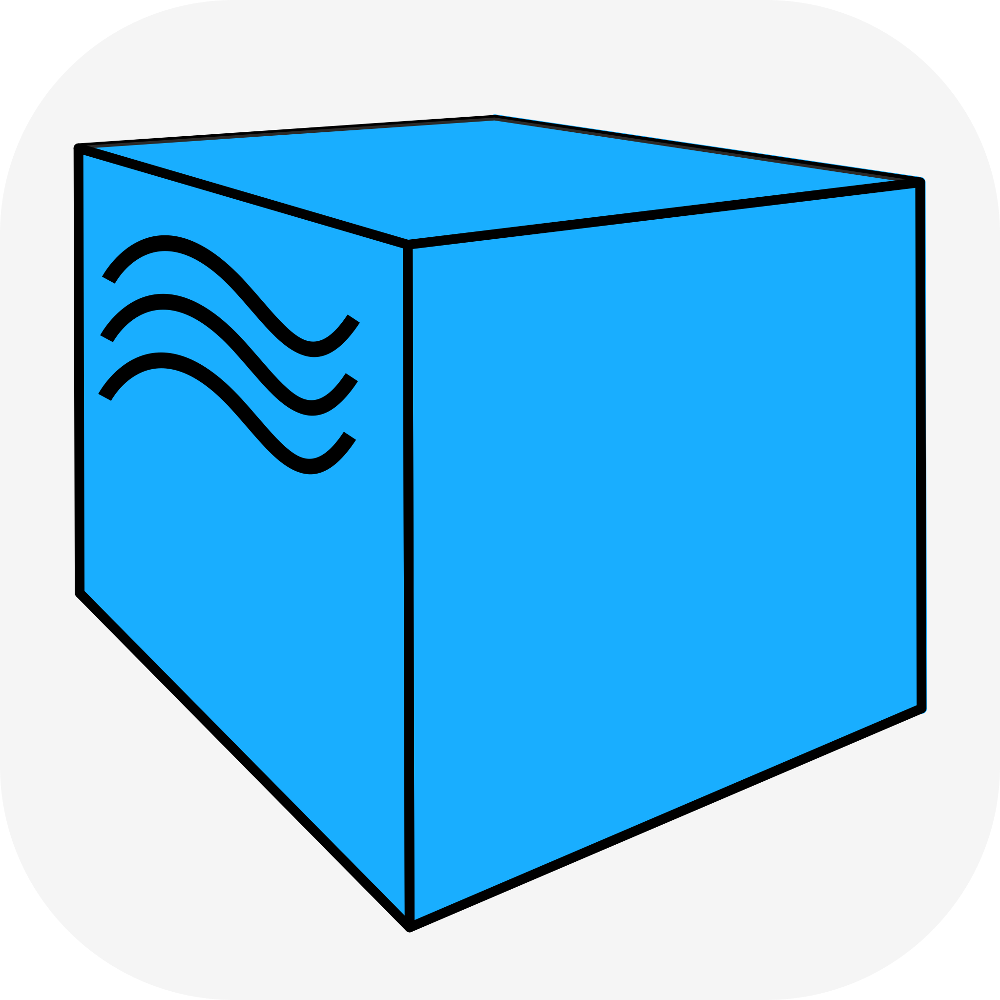</a>
<a href="https://www.browserstack.com/automate"></a></p>

## :white_check_mark: Test cases
**UI tests:**
- [x] Click on logo reopens main page
- [x] Click on participant button opens registration sidebar
- [x] Check promo title of main page
- [x] Successful opening of **Blog** page
- [x] Click **Try** button opens **Sign Up** page
- [x] **Blog page** menu items are enabled, visible and clickable *(parametrized)*
- [x] Successful opening of **Tariffs** page
- [x] Webinar tariff type contains expected tariff options *(parametrized)*

**Mobile app tests:**
- [x] Successful user login
- [x] Successful user logout
- [x] Successful user data update
- [x] Check Forgot password button functionality

[back to Contents ⬆](#contents)

## :arrow_forward: How to run
### Gradle build
There are two types of tasks for `tests`:
>- web_test
>- mobile_test

#### To run web tests locally:
```bash
$ gradle clean web_test -Denv='local'
```
Additional parameters: `-Dbrowser=` `DbrowserVersion=` `DbrowserSize=` - set parameters for the browser

#### To run mobile tests locally:
```bash
$ gradle clean mobile_test -DenvMobile='mobile-local'
```
Valid combinations of gradle command:
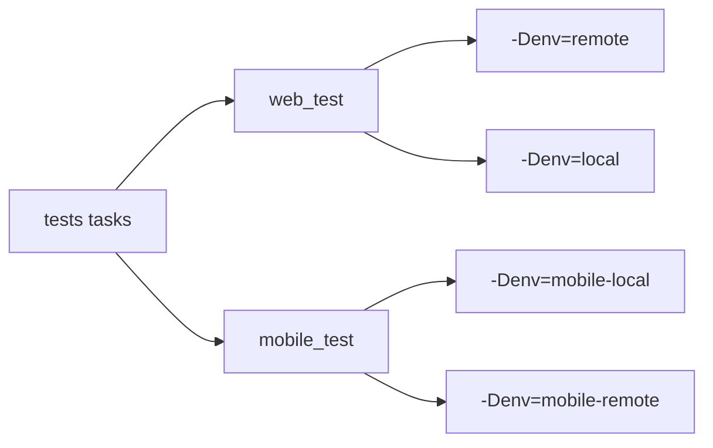

### Running tests in [Jenkins](https://jenkins.autotests.cloud/job/gloomyana_webinar_tests/)
Main page of the build:

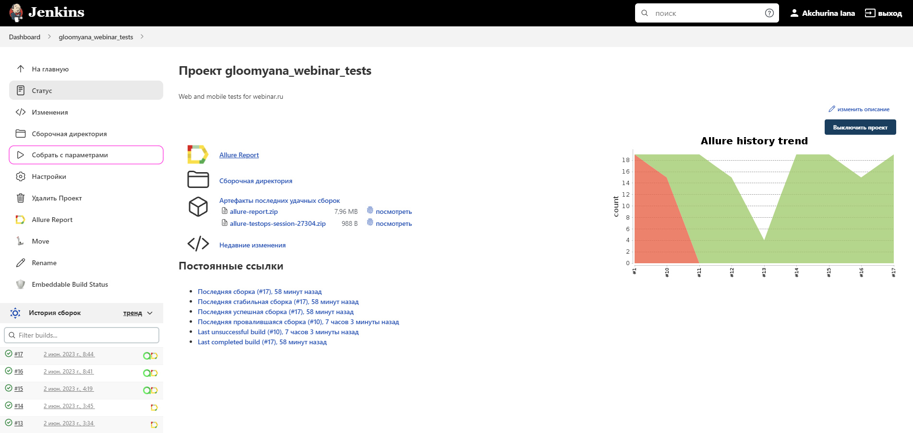

The build of the project is parameterized, so before starting it, you need to choose parameters. \
To run **all types of tests**, you must select the following options:

>- **REMOTE_URL:** `https://selenoid.autotests.cloud/wd/hub`
>- **ENV:** `remote`
>- **MOBILE_ENV:** `mobile-remote`
>- **TASK:** `test`

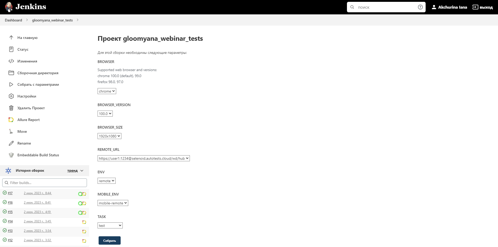

#### To run web tests only:

>- **REMOTE_URL:** `https://selenoid.autotests.cloud/wd/hub`
>- **ENV:** `remote`
>- **TASK:** `web_test`

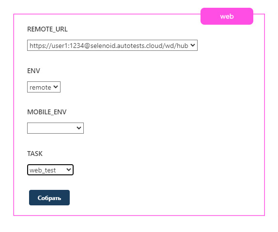

#### To run mobile tests only:

>- **REMOTE_URL:** `http://hub.browserstack.com/wd/hub`
>- **MOBILE_ENV:** `mobile-remote`
>- **TASK:** `mobile_test`

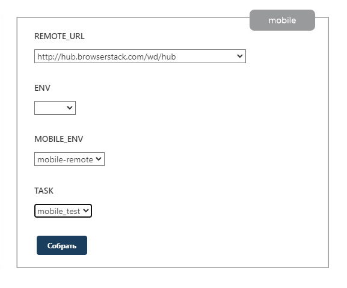

[back to Contents ⬆](#contents)

##  Test results report in [Allure Report](https://jenkins.autotests.cloud/job/gloomyana_webinar_tests/allure)
### Overview page

Overview page of Allure report contains the following parts:
>- **ALLURE REPORT** displays date and time of the test, overall number of launched tests and chart showing the percentage and number of successful, fallen and broken tests
>- **SUITES** displays groups of tests that share a common context such as a specific test environment or a particular test category
>- **FEATURES** displays groups of tests according to Epic, Feature tags
>- **TREND** displays trend of running tests for all runs
>- **CATEGORIES** displays distribution of unsuccessful tests by defect types
>- **EXECUTORS** displays information on test executors that were used to run the tests

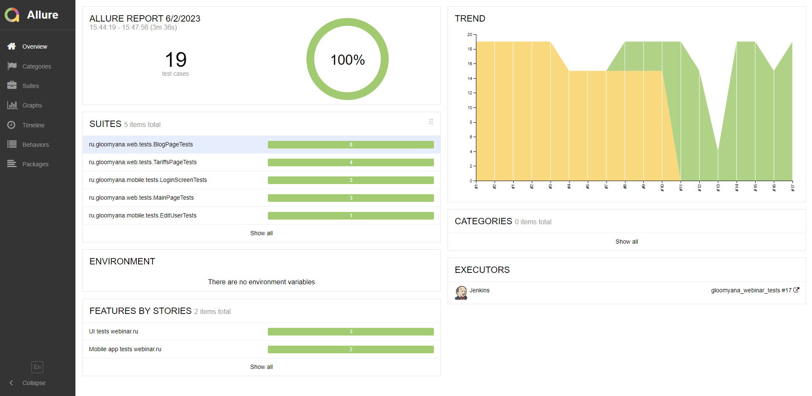

### Graphs page
Graphs allow to see different statistics collected from the test data: statuses breakdown or severity and duration diagrams.

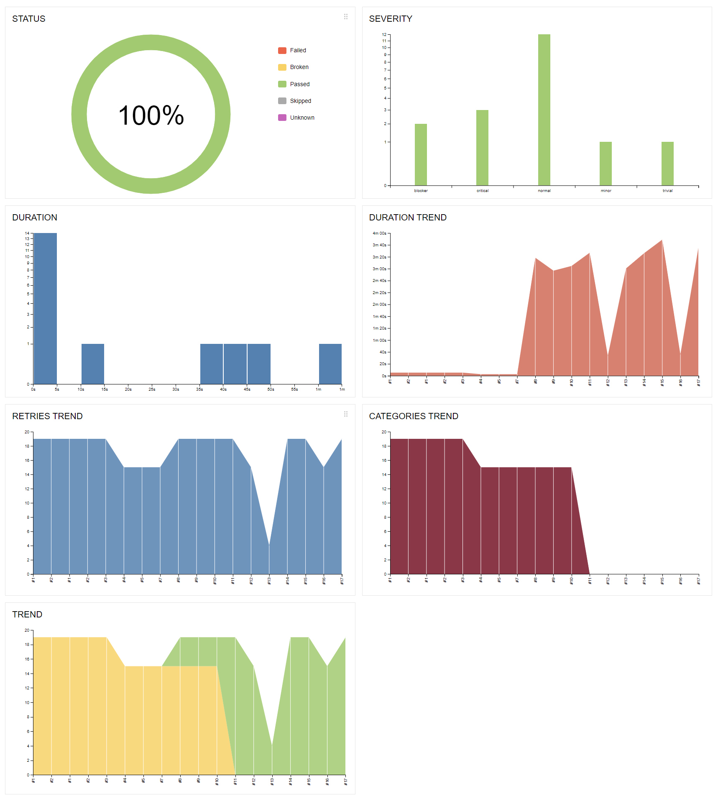

### Suites page
On the **SUITES** tab a standard structural representation of the executed tests, grouped by suites and classes can be found.
Each test case have information such as `severity`, `description`, `duration`, `test data` and execution `steps`.

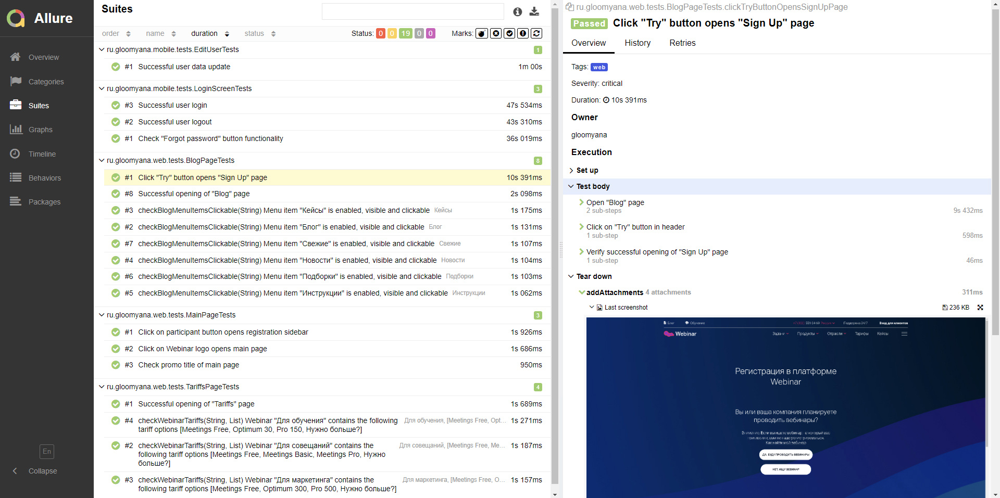

Also additional test artifacts are available:
>- Last Screenshot
>- Page Source
>- Browser console logs
>- Video

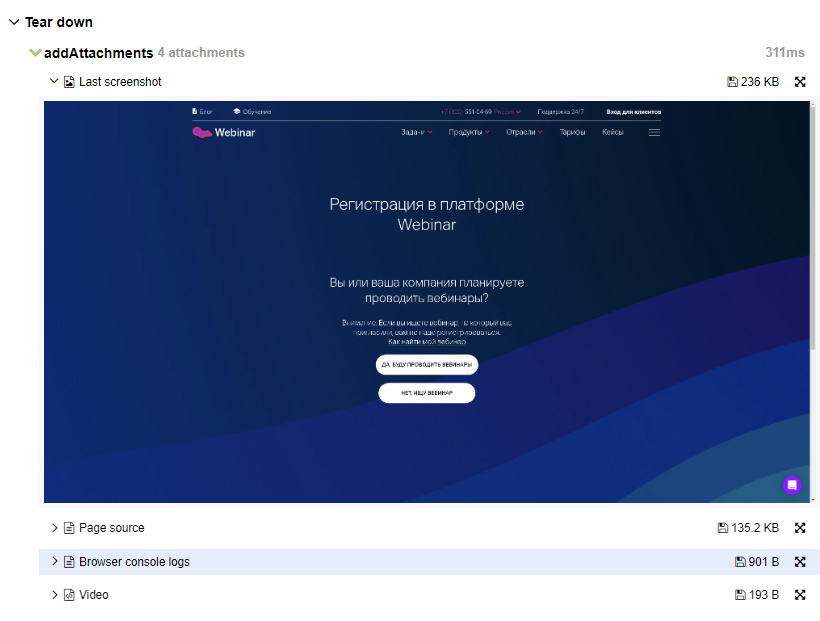

[back to Contents ⬆](#contents)

##  [Allure TestOps](https://allure.autotests.cloud/project/2582/dashboards) integration

### Dashboards


### Test cases
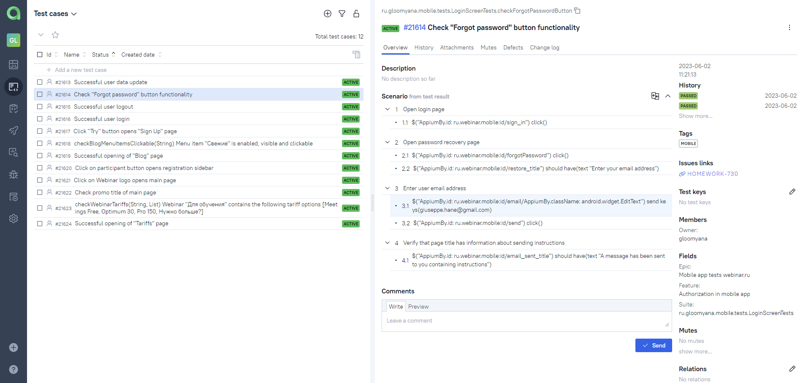

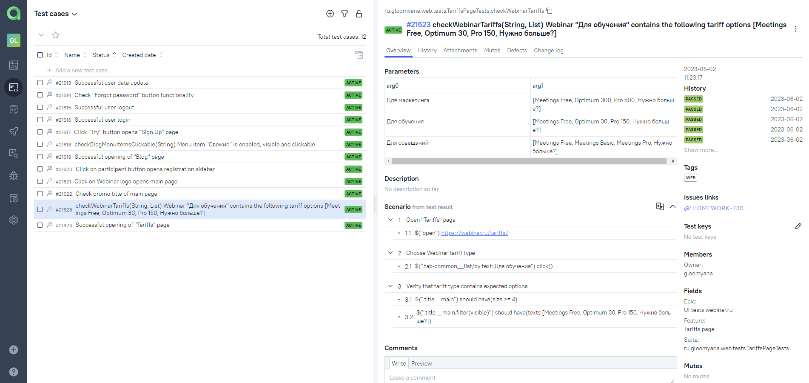

[back to Contents ⬆](#contents)

##  Jira integration
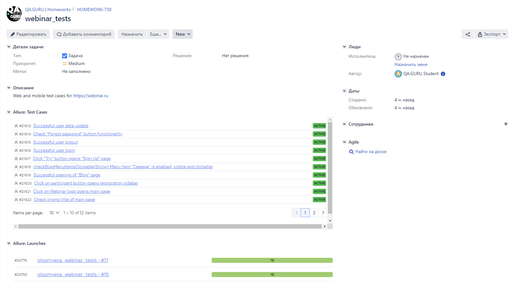

[back to Contents ⬆](#contents)

##  BrowserStack App Automate

BrowserStack Dashboard with an example of a mobile test result:

<p align="center">
 </p>

[back to Contents ⬆](#contents)

##  Telegram notifications

**Telegram bot** sends a report to a specified telegram chat by results of each project build.

<p align="center">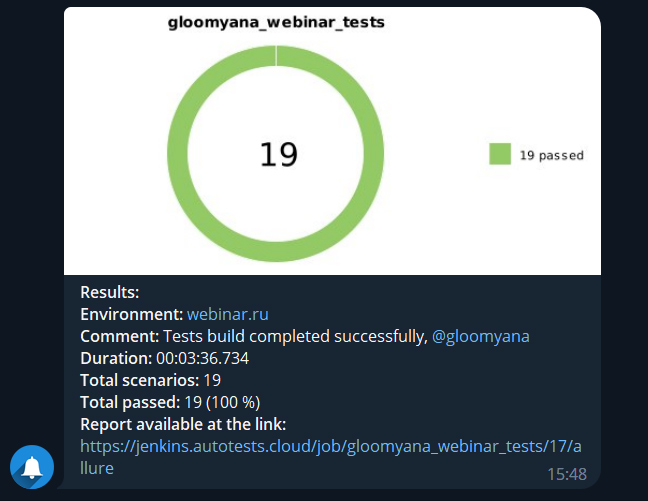
</p>

[back to Contents ⬆](#contents)

##  Sample test run in Selenoid and BrowserStack

<p align="center">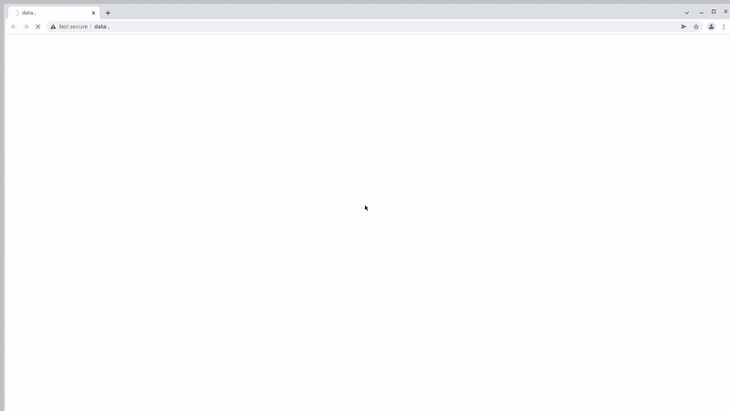
</p>

<p align="center">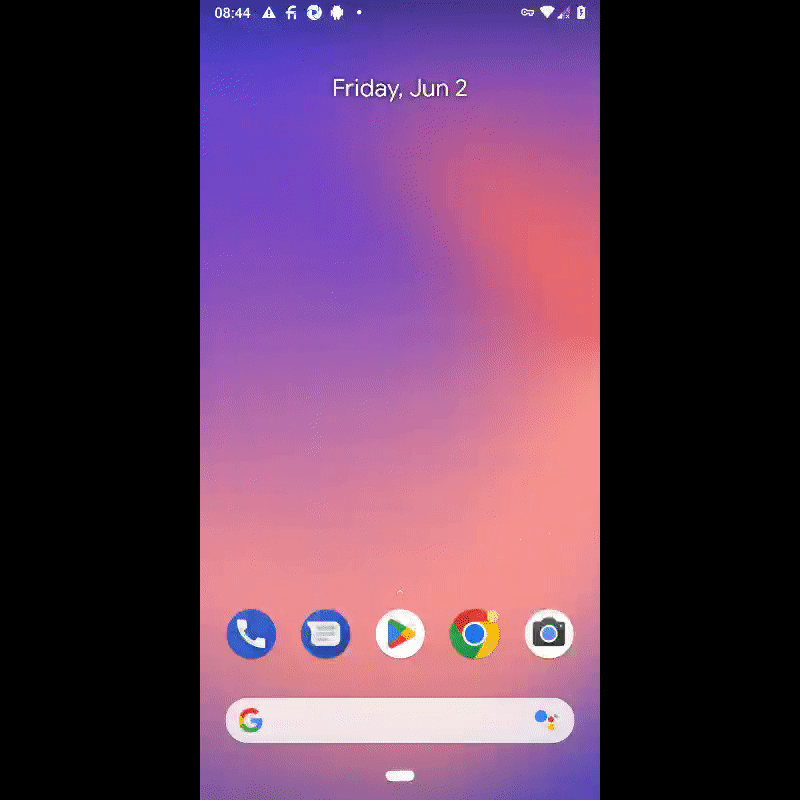
</p>

[back to Contents ⬆](#contents)
